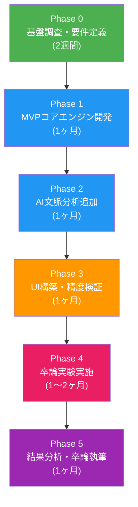
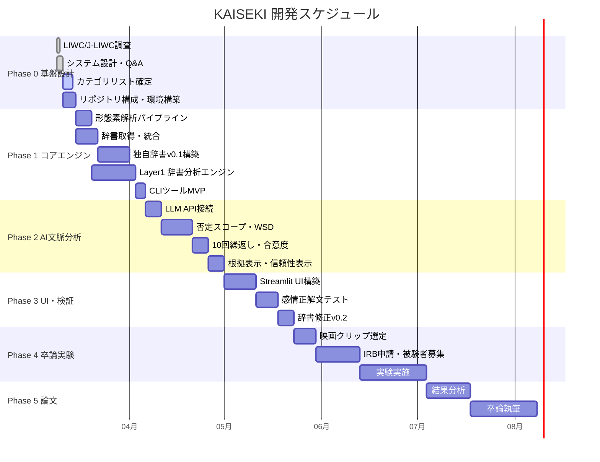
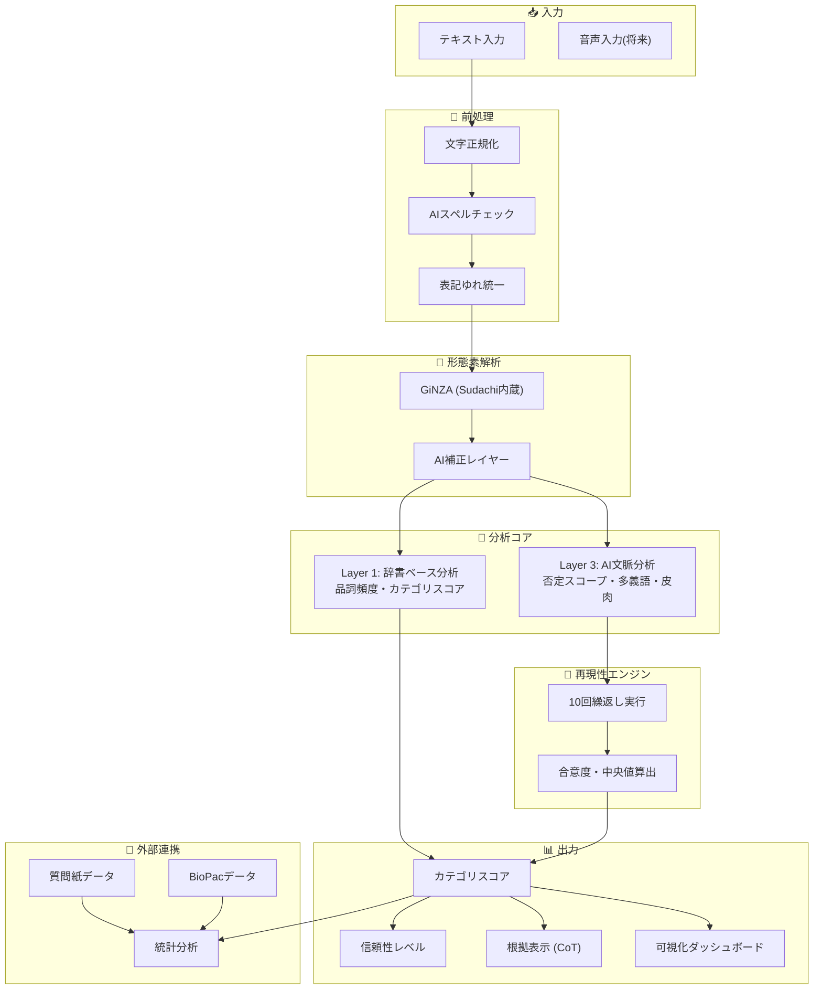
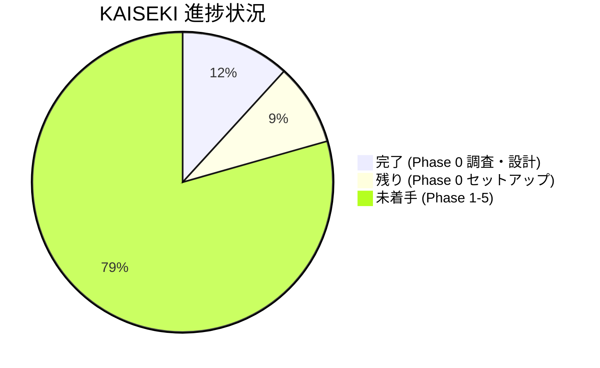

# KAISEKI 全工程表

---

## 1. プロジェクト全体フロー

---

## 2. 各フェーズの詳細タスクリスト

### Phase 0: 基盤調査・要件定義（〜2週間）

| # | タスク | 成果物 | 状態 |
|:---:|:---|:---|:---:|
| 0-1 | LIWC / J-LIWC の分析フロー・利点・限界の調査 | 分析レポート Part1-3 | ✅完了 |
| 0-2 | KAISEKIのシステム設計（アーキテクチャ、質問、利点、限界） | 設計書 | ✅完了 |
| 0-3 | 技術的疑問への回答（コスト、再現性、形態素解析等） | Q&A文書 | ✅完了 |
| 0-4 | カテゴリ戦略・辞書構築・技術スタック・被験者数の決定 | Q&A Round2 | ✅完了 |
| 0-5 | v0.1カテゴリリスト（35カテゴリ）の確定 | カテゴリ定義書 | ⬜未着手 |
| 0-6 | リポジトリ構造の設計・環境セットアップ | プロジェクト構成 | ⬜未着手 |
| 0-7 | 技術スタック動作確認（GiNZA, FastAPI, Streamlit） | 動作確認済み環境 | ⬜未着手 |

### Phase 1: MVPコアエンジン開発（1ヶ月）

| # | タスク | 成果物 | 状態 |
|:---:|:---|:---|:---:|
| 1-1 | 形態素解析パイプライン構築（GiNZA） | 解析モジュール | ⬜未着手 |
| 1-2 | 既存辞書の取得・統合（感情極性辞書、ワードネット等） | 統合辞書ファイル | ⬜未着手 |
| 1-3 | 独自辞書v0.1の構築（35カテゴリへのマッピング） | KAISEKI辞書v0.1 | ⬜未着手 |
| 1-4 | Layer 1: 辞書ベース分析エンジンの実装 | 分析コアモジュール | ⬜未着手 |
| 1-5 | 品詞頻度分析・基本統計の実装 | 統計モジュール | ⬜未着手 |
| 1-6 | CLIツールとしてのMVP完成 | CLI実行ファイル | ⬜未着手 |

### Phase 2: AI文脈分析追加（1ヶ月）

| # | タスク | 成果物 | 状態 |
|:---:|:---|:---|:---:|
| 2-1 | LLM API接続層の構築（GPT-4.1 mini or Gemini Flash） | API連携モジュール | ⬜未着手 |
| 2-2 | 否定スコープ解析の実装 | 否定処理モジュール | ⬜未着手 |
| 2-3 | 多義語曖昧性解消の実装 | WSD モジュール | ⬜未着手 |
| 2-4 | 10回繰り返し＋合意度算出の実装 | 再現性エンジン | ⬜未着手 |
| 2-5 | Chain-of-Thought根拠表示の実装 | 透明性モジュール | ⬜未着手 |
| 2-6 | 信頼性レベル自動表示の実装 | 信頼性表示機能 | ⬜未着手 |

### Phase 3: UI構築・精度検証（1ヶ月）

| # | タスク | 成果物 | 状態 |
|:---:|:---|:---|:---:|
| 3-1 | Streamlit WebUIの構築 | Webダッシュボード | ⬜未着手 |
| 3-2 | 分析結果の可視化（グラフ、テーブル） | 可視化機能 | ⬜未着手 |
| 3-3 | 感情正解文テストセットの作成 | テストコーパス | ⬜未着手 |
| 3-4 | 精度検証（正解文でのテスト） | 精度レポート | ⬜未着手 |
| 3-5 | 辞書v0.1の修正・改善 | 辞書v0.2 | ⬜未着手 |

### Phase 4: 卒論実験実施（1〜2ヶ月）

| # | タスク | 成果物 | 状態 |
|:---:|:---|:---|:---:|
| 4-1 | 日本語感情誘発映画クリップの選定・テスト | 刺激セット | ⬜未着手 |
| 4-2 | 実験プロトコル確定（4条件 × 感想文 × BioPac） | 実験計画書 | ⬜未着手 |
| 4-3 | IRB倫理審査申請 | 承認書 | ⬜未着手 |
| 4-4 | 被験者募集（40名目標） | 被験者リスト | ⬜未着手 |
| 4-5 | 実験実施 | 生データ | ⬜未着手 |
| 4-6 | KAISEKIによるテキスト分析 | 分析結果 | ⬜未着手 |

### Phase 5: 結果分析・論文執筆（1ヶ月）

| # | タスク | 成果物 | 状態 |
|:---:|:---|:---|:---:|
| 5-1 | KAISEKI結果とBioPac生理データの相関分析 | 統計結果 | ⬜未着手 |
| 5-2 | LIWC/J-LIWCとの比較分析 | 比較レポート | ⬜未着手 |
| 5-3 | 卒論執筆 | 卒業論文 | ⬜未着手 |

---

## 3. ガントチャート（タイムライン）

---

## 4. システムアーキテクチャ図

---

## 5. 現在の進捗サマリー

| 項目 | 数値 |
|:---|:---:|
| 全タスク数 | 34 |
| 完了タスク | 4 (12%) |
| 未着手タスク | 30 (88%) |
| 現在のフェーズ | Phase 0（基盤設計） |
| 次のアクション | カテゴリリスト確定 or 環境セットアップ |

---

## 6. 決定済み事項一覧

| 項目 | 決定内容 |
|:---|:---|
| カテゴリ数(MVP) | 約35カテゴリ |
| カテゴリ構築方法 | LIWCリファレンス＋日本語独自のハイブリッド |
| 辞書構築方法 | 既存辞書統合→コーパス→AI生成の三段階 |
| 開発言語 | Python |
| APIフレームワーク | FastAPI |
| Web UI | Streamlit |
| 形態素解析 | GiNZA (Sudachi内蔵) |
| LLMモデル | GPT-4.1 mini or Gemini Flash（要ベンチマーク） |
| 再現性戦略 | 10回繰返し＋多数決/中央値＋合意度記録 |
| 被験者数 | 36名（40名募集）|
| 実験デザイン | 被験者内4条件反復測定 |
| 感情誘発刺激 | 日本語映画クリップ |
| 生理指標 | HRV + EDA (BioPac) |
| ライセンス | 有償（学術割引あり） |
