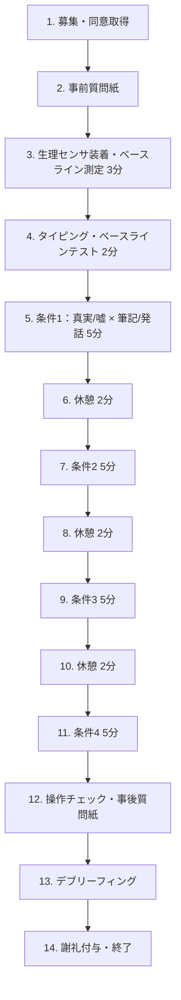

<h1>卒論実験計画書：嘘の言語的特徴の解明</h1>

---

<h2>1. 基本情報</h2>

| 項目 | 内容 |
|------|------|
| **研究題目** | 欺瞞場面における言語的特徴の多面的検証 ―KAISEKIシステムによる筆記・発話分析と生理・行動指標との関連― |
| **作成者** | 〔氏名／学籍番号〕 |
| **所属** | 〔学部・学科／ゼミ〕 |

---

<h2>2. 背景・目的（先行研究）</h2>

<h3>背景</h3>

人間は日常的に嘘をつく。DePaulo, Kashy, Kirkendol, Wyer, & Epstein（1996）の日記研究によれば、大学生は平均して1日に約2回の嘘をついている（DePaulo et al., 1996, *Journal of Personality and Social Psychology*, 70(5), 979–995, https://doi.org/10.1037/0022-3514.70.5.979 ）。嘘は社会生活の潤滑油として機能する一方、詐欺・偽証・虚偽報告などの深刻な問題にも直結する。しかし、人間が嘘を見破る精度はチャンスレベルをわずかに上回る程度（約54%）であり（Bond & DePaulo, 2006）、言語的手がかりを体系的に解析する技術の発展が求められている。

近年、自然言語処理（NLP）や計算言語学の発展に伴い、テキストから欺瞞を検出する研究が活発化している。しかし、**日本語**における欺瞞の言語的特徴に関する研究は極めて限定的であり、英語圏の知見がそのまま適用可能かは不明である。また、従来のLIWC（Linguistic Inquiry and Word Count）やJ-LIWCに代わる新たな言語解析手法の開発が望まれており、本研究ではKAISEKIシステムを用いて日本語の欺瞞言語の特徴を多角的に検証する。

<h3>先行研究の要点</h3>

<h4>先行研究A：Newman, Pennebaker, Berry, & Richards（2003）</h4>

Newman et al.（2003）は、LIWCを用いて5つの独立サンプルにおける嘘と真実の言語的差異を検討した。彼らの実験では、参加者に**中絶問題に対する意見**を題材とし、自身の本当の意見を書く条件（真実条件）と、自身の意見と反対の立場をあたかも本心であるかのように書く条件（嘘条件）を設けた。その結果、嘘をつく者は（1）一人称単数代名詞（"I"）の使用が少ない、（2）否定的感情語が多い、（3）排他語（"except", "but"）が少ない、（4）動作動詞が多い、（5）認知的複雑性が低い、という特徴を示し、61〜67%の精度で嘘と真実を弁別できることを報告した。

> Newman, M. L., Pennebaker, J. W., Berry, D. S., & Richards, J. M. (2003). Lying words: Predicting deception from linguistic styles. *Personality and Social Psychology Bulletin*, 29(5), 665–675. https://doi.org/10.1177/0146167203029005010

<h4>先行研究B：Bond & DePaulo（2006）</h4>

Bond & DePaulo（2006）は、206研究・24,483人の判定者を対象としたメタ分析を行い、人間の嘘検出精度は平均54%（嘘の正検出率47%、真実の正検出率61%）であることを示した。これは「真実バイアス」の存在を示唆しており、言語的手がかりに基づく客観的検出手法の必要性を裏付ける。

> Bond, C. F., & DePaulo, B. M. (2006). Accuracy of deception judgments. *Personality and Social Psychology Review*, 10(3), 214–234. https://doi.org/10.1207/s15327957pspr1003_2

<h4>先行研究C：Hauch, Blandón-Gitlin, Masip, & Sporer（2015）</h4>

Hauch et al.（2015）は、44研究・79の言語的手がかりを統合したメタ分析を実施し、コンピュータベースの言語分析による欺瞞検出の有効性を検証した。嘘をつく者は（1）認知的負荷が高い、（2）否定的感情が多い、（3）心理的距離が大きい、（4）感覚・知覚語が少ない、（5）認知プロセス語への言及が少ない、ことを示した。効果量は全体的に小さいが、理論駆動的な予測は支持された（効果量の小ささに関する詳細は後述の「言語的手がかりの効果量に関する詳細考察」を参照）。

> Hauch, V., Blandón-Gitlin, I., Masip, J., & Sporer, S. L. (2015). Are computers effective lie detectors? A meta-analysis of linguistic cues to deception. *Personality and Social Psychology Review*, 19(4), 307–342. https://doi.org/10.1177/1088868314556539

<h4>先行研究D：Vrij（2019）</h4>

Vrij（2019）は、欺瞞検出研究の包括的レビューを行い、研究の焦点が非言語行動の観察から発話内容の分析へ、覚醒ベースの検出から認知負荷ベースの検出へとシフトしていることを示した。認知的アプローチ（認知負荷の増大を利用した検出）や戦略的アプローチ（Strategic Use of Evidence: SUEなど）の有効性が論じられた。

> Vrij, A. (2019). Deception and truth detection when analyzing nonverbal and verbal cues. *Applied Cognitive Psychology*, 33(6), 1033–1045. https://doi.org/10.1002/acp.3588

<h4>先行研究E：キーストローク・ダイナミクスと欺瞞検出</h4>

Monaro et al.（2017）らの研究群は、タイピング行動（キーストローク間隔、入力速度、修正頻度など）が欺瞞の行動指標として機能することを示した。嘘をつく者はベースラインと比較してタイピング速度が遅くなり、入力完了までの時間が短くなる傾向がある。一部のモデルは約95%の精度で嘘と真実を弁別している。

> Monaro, M., Gamberini, L., & Sartori, G. (2017). The detection of faked identity using unexpected questions and mouse dynamics. *PLoS ONE*, 12(5), e0177851. https://doi.org/10.1371/journal.pone.0177851

<h3>本研究の位置づけ：先行研究のギャップ</h3>

1. **言語間差異の未解明**：先行研究の大半は英語を対象としており、日本語の欺瞞言語については体系的研究が乏しい。日本語特有の文法構造（主語省略、敬語、終助詞など）が欺瞞の言語的特徴にどう影響するかは未知である。
2. **解析手法の限界**：LIWCやJ-LIWCは既存の辞書ベースの分類に依拠しており、日本語の語彙的・統語的多様性を十分に捉えきれていない可能性がある。新たな解析システム（KAISEKI）の有用性を検証する必要がある。
3. **モダリティ間比較の不足**：筆記と発話、対人場面と独話場面を同一参加者内で比較した研究は少なく、コミュニケーションモダリティが欺瞞の言語的特徴に与える影響は不明確である。
4. **多面的指標の統合不足**：言語解析、生理指標、行動指標（タイピング）を同一実験内で統合的に検証した研究は限られている。

<h3>目的</h3>

本研究は、**欺瞞（嘘）場面における日本語の言語的特徴を、KAISEKIシステムを用いて多角的に解明すること**を目的とする。具体的には、（1）嘘と真実の筆記において日本語の言語的特徴（語彙選択、文構造、感情表現等）にどのような差異が生じるかを明らかにし、（2）その言語的特徴と質問紙データ（心理特性）、生理データ（皮膚電気活動・心拍）、行動データ（タイピング・パターン）との関連を検証する。

<h3>本テーマが否定される可能性の検証</h3>

本テーマの妥当性に対する潜在的な反論として、以下の点が挙げられる：

1. **効果量の小ささ**：Hauch et al.（2015）のメタ分析が示すように、言語的手がかりの効果量は総じて小さい。これは、言語的特徴のみでは欺瞞を確実に検出することが困難であることを意味する。ただし、本研究は「検出」を目的とするのではなく、「言語的特徴の記述・解明」を主眼とするため、小さな効果量でも科学的に意義がある。

2. **文化・言語間の転移可能性**：英語圏で見出された言語的手がかり（一人称代名詞の減少など）が日本語に直接適用できない可能性がある。特に日本語は主語省略が一般的であり、代名詞使用のパターンは英語とは質的に異なる。しかし、これはむしろ本研究の意義を強調するものであり、日本語固有の欺瞞の言語的特徴を発見する機会である。

3. **エコロジカル・バリディティ**：実験室で誘発された嘘は、現実場面の嘘とは性質が異なる可能性がある（ステークスの低さ）。この限界に対し、本研究では複数のモダリティ（筆記・発話）と社会的文脈（対人・独話）を設け、生態学的妥当性を高める。

<h4>言語的手がかりの効果量に関する詳細考察</h4>

欺瞞の言語的手がかりの効果量が小さいことは、本研究領域で繰り返し指摘されてきた重要な論点である。以下にその背景、原因、および本研究における対処方針を詳述する。

**1. 効果量の実態**

Hauch et al.（2015）のメタ分析では、79の言語的手がかりの平均効果量（Cohen's d）は多くが **d = 0.10〜0.30** の範囲にあり、Cohenの基準（d = 0.20: 小、d = 0.50: 中、d = 0.80: 大）に照らして「小」に分類される。例えば、一人称代名詞の減少は d ≈ 0.17、否定的感情語の増加は d ≈ 0.14、感覚・知覚語の減少は d ≈ 0.23 程度であった。Newman et al.（2003）のLIWCによる弁別精度（61〜67%）もチャンスレベル（50%）を有意に上回るものの、実用的な検出水準には達していない。

**2. 効果量が小さい理由**

効果量が小さい背景には、以下の複合的な要因がある：

- **嘘の多様性**：嘘には「社交辞令的な軽い嘘」から「計画的な重大な虚偽」まで質的な幅があり、すべての嘘が同一の言語的特徴を示すわけではない。メタ分析ではこれらを統合するため、効果が相殺される（DePaulo et al., 2003, *Psychological Bulletin*, 129(1), 74–118, https://doi.org/10.1037/0033-2909.129.1.74 ）。

- **個人差の大きさ**：嘘をつく能力や方略には著しい個人差がある。自己モニタリング傾向が高い者やマキャベリアニズム傾向の高い者は、言語的手がかりが露出しにくい。Vrij（2008）は、良い嘘つき（good liars）と悪い嘘つき（bad liars）で言語的特徴が大きく異なることを指摘している（Vrij, A., 2008, *Detecting Lies and Deceit: Pitfalls and Opportunities*, 2nd ed., Wiley）。

- **文脈依存性（モデレータの影響）**：Hauch et al.（2015）のメタ分析では、効果量が以下のモデレータによって有意に変動することが示された：（a）**出来事の種類**（意見 vs. 体験の語り）、（b）**関与度**（経験した出来事 vs. 架空の出来事）、（c）**感情的な性質**（ポジティブ vs. ネガティブな内容）、（d）**動機づけの強さ**（嘘がバレた場合の結果の重大性）。つまり、効果量はこれらの条件によって大きくなったり小さくなったりするため、全体を平均すると効果が希釈される。

- **測定の粗さ**：従来のLIWCは辞書ベースの単語カウントに依存しており、文脈・皮肉・比喩といった高次の言語現象を捕捉できない。この測定精度の限界が、真の効果量を過小推定している可能性がある。

**3. 効果量が小さいことの意味と本研究の位置づけ**

効果量が小さいことは、研究の価値を否定するものではない。以下の理由により、本研究は十分な学術的意義を有する：

- **理論的意義**：小さくとも一貫した効果があるということは、欺瞞と言語行動を結びつける心理メカニズム（認知負荷、感情漏洩、自己距離化）が実在することの証左である。本研究の目的は「嘘を完璧に検出すること」ではなく、「嘘をつく際にどのような言語的変化が生じるかを科学的に記述すること」である。

- **多指標統合による改善**：単一の言語的手がかりの効果量は小さくとも、複数の手がかりを組み合わせることで弁別力は向上する。実際にNewman et al.（2003）はLIWCの複数カテゴリを統合したモデルにより67%の精度を達成した。さらに、本研究では言語指標に加えて生理指標（EDA・心拍）およびタイピング行動を同時測定するため、**マルチモーダル**なアプローチにより単一指標の限界を補完できる。

- **新たな解析手法の可能性**：従来のLIWCが辞書ベースの粗い分類に限定されていたのに対し、KAISEKIシステムではより精密な言語解析が期待される。測定精度の向上が、これまで検出し損ねていた微細な言語的変化を捕捉し、効果量の改善につながる可能性がある。

- **日本語固有の発見可能性**：英語圏で効果量が小さかった手がかり（例：一人称代名詞の減少）が日本語では異なるパターンを示す可能性がある。日本語の主語省略、終助詞の使用、敬語体系の切り替えなどは、英語にはない欺瞞手がかりとなり得る。これらは従来のメタ分析では検証されていない新規の指標であり、英語圏とは異なる効果量を示す可能性がある。

- **参照基準としての位置づけ**：心理学研究全般において、d = 0.20 程度の「小さい」効果は珍しくない。Richard, Bond, & Stokes-Zoota（2003）のメタメタ分析では、社会心理学領域の平均効果量は r = .21（d ≈ 0.43）であり、欺瞞研究の効果量もこの範囲内にある（Richard, F. D., Bond, C. F., & Stokes-Zoota, J. J., 2003, *Review of General Psychology*, 7(4), 331–363, https://doi.org/10.1037/1089-2680.7.4.331 ）。

**理論的基盤**：本研究は以下の理論的枠組みに立脚する。

- **認知負荷理論**（Vrij et al., 2008）：嘘をつくことは真実を語ることより認知的に負荷が高く、言語産出の複雑性・流暢性に影響を与える。
- **対人欺瞞理論**（Interpersonal Deception Theory; Buller & Burgoon, 1996）：欺瞞は対人コミュニケーション過程であり、相手の存在が欺瞞者の言語行動を変容させる。
- **自己距離化仮説**（Newman et al., 2003）：嘘をつく者は虚偽の内容から心理的に距離を取るため、一人称代名詞の使用が減少し、抽象的表現が増加する。

---

<h2>3. 研究課題・仮説</h2>

<h3>研究課題（RQ）</h3>

- **RQ1**：嘘を筆記する場面と真実を筆記する場面で、日本語の言語的特徴（KAISEKIによる解析結果）にどのような差異が見られるか。
- **RQ2**：欺瞞の言語的特徴は、コミュニケーションのモダリティ（筆記 vs. 発話）や社会的文脈（対人 vs. 独話）によってどのように変化するか。
- **RQ3**：KAISEKIによる言語的特徴は、質問紙で測定された心理特性、生理指標、およびタイピング行動とどのように関連するか。

<h3>仮説（H）</h3>

- **H1（認知負荷仮説）**：嘘条件では真実条件と比較して、文の複雑性が低下し（短文化、接続詞の減少）、認知プロセスに関連する語彙の出現パターンが変化する。
- **H2（心理的距離仮説）**：嘘条件では真実条件と比較して、自己言及（一人称表現）が減少し、感覚・知覚的詳細の記述が減少する。
- **H3（感情漏洩仮説）**：嘘条件では真実条件と比較して、否定的感情語の使用頻度が増加する。
- **H4（モダリティ効果仮説）**：筆記条件では発話条件と比較して、欺瞞の言語的特徴がより明確に出現する（筆記は推敲が可能であるため、認知資源の配分が異なる）。
- **H5（対人効果仮説）**：対人条件では独話条件と比較して、相手の反応を意識した言語的修正（丁寧語の増加、曖昧表現の増加、自己モニタリングの痕跡）が増加する。
- **H6（生理-言語対応仮説）**：生理的覚醒（皮膚コンダクタンス反応の増大、心拍数の上昇）と言語的特徴の変化（否定的感情語の増加、認知複雑性の低下）は正の関連を示す。
- **H7（行動-言語対応仮説）**：嘘条件では真実条件と比較して、タイピング速度の低下、キーストローク間隔の増大、バックスペース使用頻度の増加が見られ、これらは言語的複雑性の低下と関連する。

---

<h2>4. 研究デザイン</h2>

- **デザイン**：実験（参加者内計画を主とする混合デザイン）
- **要因計画**：**2（真偽：真実 vs. 嘘）× 2（モダリティ：筆記 vs. 発話）** 参加者内計画
  - 独立変数1：記述内容の真偽（真実条件・嘘条件）
  - 独立変数2：コミュニケーション・モダリティ（筆記条件・発話条件）

> [!IMPORTANT]
> **条件設計に関する議論**：ユーザーが提示した4条件（対人筆記・対人会話・一人筆記・一人会話）について、本計画では実施可能性と統計的検出力のバランスを考慮し、**筆記条件（一人筆記）と発話条件（一人発話＝独話録音）の2モダリティ × 真偽**の参加者内計画を主デザインとする。対人条件（相手がいる状態での筆記・会話）は交互作用を複雑化させ、統制も困難であるため、**将来の拡張研究**として位置づける。ただし、ゼミの判断で対人条件を追加する場合に備え、拡張案も後述する。

- **無作為化**：条件提示の順序をラテン方格法により参加者間でカウンターバランスする。
- **統制**：
  - 実験環境（静穏な個室、照明・温度統一）
  - 時間帯（概日リズムの影響を避け、10:00〜17:00に限定）
  - 順序効果（ラテン方格法によるカウンターバランス）
  - 教示（標準化されたスクリプトを使用）
  - 筆記テーマ（全参加者に同一トピックを付与）
- **ブラインド**：単盲検（実験者は条件を把握するが、参加者は研究の具体的仮説を知らない）

<h3>拡張案：対人条件を含む場合</h3>

完全デザインとして **2（真偽）× 2（モダリティ：筆記 vs. 発話）× 2（社会的文脈：対人 vs. 独話）** の参加者内計画も検討可能。この場合、8条件となり、必要サンプルサイズが増大する（n ≈ 60〜80）。

> [!TIP]
> **対人条件の相手としてAI対話機能を活用する案**：対人条件の「話し相手」にAIの対話機能（チャット形式／音声対話形式）を使用することで、聞き手の反応パターンを全参加者間で完全に統制できる。人間の聞き手を配置する場合と比べ、（1）統制の完全性、（2）実施コストの削減、（3）二重盲検に近い統制、が実現可能。条件名は「対人」ではなく「対話的文脈（AI対話）」とする。

---

<h2>5. 参加者（対象）</h2>

- **対象**：大学生（18歳以上）
- **予定人数**：**n = 50**（最低40名、理想的には60名）
  - **根拠**：参加者内計画における中程度の効果量（d = 0.40〜0.50）を仮定し、α = .05（両側）、検出力 1 − β = .80 の条件でG*Powerによるパワー分析を実施した場合、対応ありt検定で必要なサンプルサイズは約34〜52名となる。脱落・除外を考慮し50名を目標とする（Faul, Erdfelder, Lang, & Buchner, 2007, *Behavior Research Methods*, 39(2), 175–191, https://doi.org/10.3758/BF03193146 ）。
- **選定方法**：授業内での募集またはSNS等を通じた募集。謝礼として単位加点または図書カード（500〜1000円相当）を付与。
- **適格基準**：
  - 18歳以上の大学生
  - 日本語を母語とする者
  - 通常の視力・聴力を有する者（矯正を含む）
  - タイピングが可能な者
- **除外基準**：
  - 精神疾患の治療中の者
  - 実験手続きの理解が困難な者
  - データの大部分が欠測の者（全体の30%以上の欠測）

---

<h2>6. 変数の操作的定義</h2>

<h3>独立変数（IV）</h3>

| 変数名 | 操作方法 |
|--------|----------|
| **真偽条件** | 真実条件：実際に経験した出来事について記述する。嘘条件：経験していない架空の出来事をあたかも真実であるかのように記述する。 |
| **モダリティ** | 筆記条件：PCキーボードを用いたタイピングで記述。発話条件：マイクに向かって口頭で語る（録音）。 |

<h4>筆記トピックの選定（先行研究に基づく）</h4>

先行研究では、欺瞞実験のトピックとして以下の2つのアプローチが広く用いられている：

**（A）意見・態度に関する嘘（Opinion-based deception）**

Newman et al.（2003）は、**中絶問題に対する自身の意見**を題材とし、真の意見を書く条件と、反対の立場をあたかも本心であるかのように書く条件を設けた。研究者は参加者の真の態度を事前に把握していたため、嘘の操作が明確に統制されていた。このパラダイムの利点は、参加者全員が同一のトピックについて書くため条件間の比較が容易であることと、「本当の意見」を事前質問紙で確認できるため操作チェックが容易であることである。

> Newman, M. L., et al. (2003). 前掲書.

**（B）体験の語りに関する嘘（Experience-based deception）**

Vrij, Mann, Fisher, Leal, Milne, & Bull（2008）は、参加者に**自分が実際に行った活動（例：昼食を食べた場所、行った店）**について真実を語る条件と、**行っていない場所に行ったかのように**虚偽を語る条件を設けた。このパラダイムは、感覚的詳細や空間的情報の記述量が真偽で明確に異なるという利点がある。

> Vrij, A., Mann, S., Fisher, R. P., Leal, S., Milne, R., & Bull, R. (2008). Increasing cognitive load to facilitate lie detection: The benefit of recalling an event in reverse order. *Law and Human Behavior*, 32(3), 253–265. https://doi.org/10.1007/s10979-007-9103-y

**本研究での採用方針**

本研究では、上記2つのパラダイムを組み合わせた**2種類のトピック**を条件間でカウンターバランスして使用する。文化的配慮の観点から、トピックは日本の大学生にとって馴染みがあり、かつ意見が分かれやすいものに調整する：

| トピック | 真実条件 | 嘘条件 | パラダイム |
|----------|----------|--------|------------|
| **トピックA：個人的体験** | 「最近実際に行った場所（旅行・外出先）について、できるだけ詳しく書いてください」 | 「行ったことのない場所に行ったかのように、できるだけ詳しく書いてください」 | 体験型（Vrij et al., 2008） |
| **トピックB：意見・態度** | 「SNSでの実名公開の是非について、あなたの本当の意見を書いてください」 | 「SNSでの実名公開の是非について、あなたの本心とは反対の意見を、あたかも本心であるかのように書いてください」 | 意見型（Newman et al., 2003） |

> [!NOTE]
> Newman et al.（2003）は「中絶問題」を使用したが、日本の大学生の文化的背景を考慮し、本研究ではより身近で議論が分かれやすいトピック（SNSでの実名公開）に置き換えた。事前の態度調査を実施し、参加者の真の態度を把握した上で嘘条件を割り当てる。

<h3>従属変数（DV）</h3>

<h4>A. 言語的指標（KAISEKI解析による）</h4>

- KAISEKIシステムによる解析結果（具体的な指標はKAISEKIの開発・確定後に決定。以下は想定される指標カテゴリ）
  - 語彙的特徴（品詞分布、語彙多様性、特定語類の出現頻度）
  - 文構造的特徴（文長、文の複雑性、接続詞使用）
  - 感情・心理的特徴（感情語、認知プロセス語、自己言及語）
  - 詳細度（感覚・知覚語、空間・時間的参照）

<h4>B. 質問紙指標</h4>

- **特性不安尺度**（STAI-T; Spielberger, 1983）：状態不安と特性不安の測定
- **自己モニタリング尺度**（Snyder, 1974; 岩淵, 1982 日本語版）：自己呈示の傾向
- **マキャベリアニズム尺度**（Mach-IV; Christie & Geis, 1970; 堀内・小口, 2007 日本語版）：操作的対人態度
- **社会的望ましさ尺度**（SDS; Marlowe-Crowne, 1960; 北村・鈴木, 1986 日本語版）：回答バイアスの統制
- **日本語版Big Five短縮版**（BFS; 並川ら, 2012）：パーソナリティ特性

<h4>C. 生理指標</h4>

- **皮膚コンダクタンス反応（SCR／EDA）**：**Biopac MP36** を使用。EDA100Cモジュールにより、非利き手の第2・第3指に Ag-AgCl 電極を装着し、皮膚電気活動を連続記録する。ベースライン（安静3分間）と各条件中のトニック・レベル（SCL）およびフェイジック反応（SCR）を測定。サンプリングレートは200 Hz以上とする。
- **心拍数（HR）／心拍変動（HRV）**：**Biopac MP36** のECG100Cモジュールまたはパルスオキシメトリセンサ（PPG100C）を使用。R-R間隔からHR（bpm）およびHRV（RMSSD、LF/HF比）を算出する。

<h4>D. 行動指標（タイピング・データ）</h4>

- **タイピング速度**（文字数/分）
- **キーストローク間隔**（Inter-Keystroke Interval: IKI）（ms）
- **ポーズ頻度・持続時間**（2秒以上の入力停止）
- **バックスペース・削除キー使用頻度**（修正行動）
- **総入力時間**

<h3>統制変数／共変量</h3>

- 年齢、性別、タイピング習熟度（自己評価5段階＋ベースライン・タイピングテスト）、気分状態（POMS短縮版）、睡眠時間（前夜）

---

<h2>7. 使用材料・尺度・装置</h2>

<h3>刺激・課題</h3>

| 項目 | 内容 |
|------|------|
| **筆記トピック** | トピックA（個人的体験：旅行・外出先）とトピックB（意見・態度：SNS実名公開の是非）を条件間でカウンターバランスして使用（詳細は第6節参照）。 |
| **教示文** | 標準化された書面による教示。嘘条件では「読み手にとって、あなたが本当のことを言っていると信じられるように書いてください」と強調（Newman et al., 2003 の教示に準拠）。 |
| **筆記時間** | 各条件5分間（計4セッション：真実筆記・嘘筆記・真実発話・嘘発話） |

<h3>質問紙</h3>

| 尺度名 | 項目数 | 回答形式 | 信頼性（α） |
|--------|--------|----------|-------------|
| STAI（状態-特性不安） | 40項目 | 4件法 | .85–.92 |
| 自己モニタリング尺度 | 25項目 | 2件法 | .70–.75 |
| Mach-IV | 20項目 | 7件法 | .70–.80 |
| SDS | 33項目 | 2件法 | .73–.88 |
| BFS（Big Five短縮版） | 29項目 | 7件法 | .75–.85 |
| POMS短縮版 | 30項目 | 5件法 | .80–.90 |

<h3>実験ソフト・装置</h3>

| 項目 | 詳細 |
|------|------|
| **筆記記録** | 専用Webアプリケーション（キーストローク・ロギング機能付き）またはInputLog等のキーストローク記録ソフト |
| **音声録音** | ICレコーダーまたはPC内蔵マイク（サンプリングレート44.1kHz以上） |
| **生理計測** | **Biopac MP36**（EDA100C: 皮膚電気活動、ECG100CまたはPPG100C: 心拍）。解析ソフトはAcqKnowledge 5.0を使用。 |
| **質問紙** | Qualtrics、Google Forms、またはLimeSurveyによるオンライン実施 |
| **デバイス** | デスクトップPCまたはノートPC（外付けキーボード統一） |
| **音声書き起こし** | Whisper（OpenAI）等の自動音声認識を使用し、手動校正 |

---

<h2>8. 手続き（参加者の流れ）</h2>

<h3>詳細手続き</h3>

1. **募集・同意取得（5分）**
   - インフォームド・コンセント用紙の提示（研究目的の概要説明、嘘をつく課題が含まれることの告知、撤回権の説明）
   - 書面による同意書への署名

2. **事前質問紙（15分）**
   - 属性情報（年齢、性別、利き手、タイピング経験年数）
   - BFS、Mach-IV、自己モニタリング尺度、SDS
   - POMS短縮版（実験時点の気分）
   - **トピックBの事前態度調査**：「SNSでの実名公開」に対する賛否（7件法）を測定し、嘘条件での態度反転の基準とする

3. **生理センサ装着・ベースライン測定（5分）**
   - Biopac MP36のEDA電極（非利き手の第2・第3指）および心拍センサの装着
   - 安静状態でのベースライン測定（3分間、閉眼安静）
   - AcqKnowledge 5.0で記録開始

4. **タイピング・ベースラインテスト（2分）**
   - 中立的な文章（例：「今日の天気について書いてください」）を筆記し、個人のタイピング速度のベースラインを取得

5. **実験セッション（各5分 × 4条件 + 休憩）**
   - 4条件をラテン方格法により順序をカウンターバランス
   - 各条件の開始前に教示文を画面に表示（30秒間）
   - 条件間に2分間の休憩（中立的な画像のスライドショーを提示し、感情のリセットを図る）
   - **筆記条件**：PC画面上のテキストエディタに入力。キーストロークは自動記録。
   - **発話条件**：マイクに向かって口頭で語る。音声は自動録音。
   - 全条件を通じてBiopac MP36でEDA・心拍を連続記録

6. **操作チェック・事後質問紙（10分）**
   - STAI（状態不安）
   - 操作チェック項目：「各セッションでどの程度真剣に嘘をつきましたか」（7件法）、「嘘がばれないようにどの程度努力しましたか」（7件法）、「各セッションの難易度」（7件法）
   - 主観的嘘つき能力の自己評価

7. **デブリーフィング（5分）**
   - 研究目的と仮説の詳細説明
   - 嘘をつく課題の意義の説明
   - 同意の再確認（データ使用への最終同意）
   - 質疑応答、研究者連絡先の提示

8. **謝礼付与・終了**

**※ 所要時間：約65〜75分**

---

<h2>9. 分析計画（統計）</h2>

<h3>データ前処理</h3>

| 処理 | 基準 |
|------|------|
| **欠測処理** | 各尺度で10%以上の項目が欠測の場合は当該尺度を除外。10%未満は平均値代入または多重代入法。 |
| **外れ値** | 生理データ：3SDを超える値の除外。タイピングデータ：IKI < 50ms または > 5000ms の除外。 |
| **尺度逆転項目** | 各質問紙の逆転項目を再コーディング後に合計得点・下位尺度得点を算出。 |
| **音声データ** | 自動音声認識で書き起こし → 手動校正 → KAISEKI解析用テキストに変換。 |
| **生理データ** | Biopac AcqKnowledgeによるベースライン補正（各条件値 − ベースライン値）、ローパスフィルタ処理（EDA: 1Hz）。SCR検出閾値は0.05μS。 |

<h3>主分析</h3>

<h4>分析1：嘘と真実の言語的差異（H1–H3）</h4>

- **2（真偽）× 2（モダリティ）反復測定分散分析（ANOVA）**
- 従属変数：KAISEKIによる各言語指標（語彙多様性、文の複雑性、感情語頻度、自己言及語頻度など）
- 主効果および交互作用の検定
- 交互作用が有意な場合：単純主効果検定

<h4>分析2：モダリティ効果と社会的文脈効果（H4–H5）</h4>

- 分析1と同一の反復測定ANOVAの交互作用を検討
- 筆記データとエディティング行動の関連分析

<h4>分析3：生理-言語対応（H6）</h4>

- **ピアソンの積率相関係数**：生理指標（SCR振幅変化量、HR変化量）と言語指標の相関分析
- **重回帰分析**：言語指標を従属変数、生理指標を独立変数とする（統制変数を共変量として投入）
- 必要に応じて**マルチレベルモデル**（被験者内のネスト構造を考慮）

<h4>分析4：行動-言語対応（H7）</h4>

- **ピアソンの積率相関係数**：タイピング指標（IKI、ポーズ頻度、バックスペース頻度）と言語指標の相関分析
- **対応ありt検定**：真実条件と嘘条件におけるタイピング指標の比較

<h4>分析5：個人差変数の影響</h4>

- **階層的重回帰分析**：ステップ1に統制変数（年齢、性別）、ステップ2に個人差変数（Mach-IV、自己モニタリング、Big Five）を投入し、言語指標の分散説明率の増分を検討

<h3>効果量・信頼区間</h3>

| 手法 | 効果量 |
|------|--------|
| t検定 | Cohen's d + 95% CI |
| ANOVA | partial η² + 90% CI |
| 相関分析 | r + 95% CI |
| 回帰分析 | R²、ΔR²、β |

- **有意水準**：α = .05（両側）
- **多重比較補正**：Bonferroni法またはHolm法（KAISEKIの指標数に応じて調整）

<h3>追加分析（探索的）</h3>

- 機械学習的アプローチ（ランダムフォレスト、SVM等）による嘘/真実の分類精度の検証（交差検証法を使用）
- テキストの質的分析（嘘に特徴的な表現パターンの帰納的抽出）

---

<h2>10. 期待される結果と解釈</h2>

<h3>期待される結果パターン</h3>

1. **嘘条件では真実条件と比較して**：
   - 文の複雑性が低い（短文、接続詞の減少）
   - 自己言及語（「私」「自分」等）の使用が減少
   - 否定的感情語（「不安」「心配」「嫌」等）が増加
   - 感覚・知覚的詳細（「見た」「聞いた」「触った」等）が減少
   - 抽象的・曖昧な表現が増加

2. **筆記条件と発話条件の交互作用**：
   - 筆記条件では推敲が可能なため、発話条件と比較して嘘と真実の差異がやや小さくなる（言語的修正による差異の縮小）
   - 一方、タイピング行動には欺瞞の痕跡がより明確に現れる（修正行動の増加）

3. **生理-言語の対応**：
   - 皮膚コンダクタンス反応が大きい（覚醒が高い）ほど、否定的感情語が多く、認知複雑性が低い文を産出する

4. **タイピング-言語の対応**：
   - 嘘条件でのタイピング速度低下・ポーズ増加は、認知的負荷の増大を反映し、言語的複雑性の低下と相関する

<h3>理論的含意</h3>

- Newman et al.（2003）やHauch et al.（2015）の英語圏の知見が日本語においても（修正を加えつつ）妥当するかを検証でき、欺瞞の言語的手がかりの**言語横断的普遍性と文化固有性**の理解に貢献する。
- 認知負荷理論と自己距離化仮説の日本語における妥当性を検証できる。
- KAISEKIシステムの妥当性検証として、既知の心理変数（質問紙）および客観的指標（生理・行動）との併存的妥当性（concurrent validity）のエビデンスが得られる。

<h3>実践的含意</h3>

- **犯罪捜査・法心理学**：供述分析や虚偽検出の補助ツールとしての言語解析の可能性を示唆。
- **組織・ビジネス**：報告書やレポートにおける虚偽記述の検出への応用。
- **教育**：レポート不正（剽窃・捏造）の検出支援。
- **コミュニケーション研究**：日本語の対人コミュニケーションにおける欺瞞のメカニズムの理解を深める。

---

<h2>11. 倫理的配慮</h2>

<h3>同意</h3>

- **任意参加**：参加は完全に任意であり、不参加による不利益は一切ない旨を明示。
- **途中撤回可**：実験中のいつでもデータ提供の撤回が可能。撤回によるペナルティなし。
- **十分な説明**：研究の概要（嘘をつく課題を含むこと）、データの扱いについて事前に書面で説明。

<h3>個人情報保護</h3>

- **匿名化**：参加者には実験IDを付与し、個人識別情報（氏名、学籍番号）とは分離して管理。
- **連絡先分離**：謝礼連絡・フォローアップ用の連絡先は、研究データとは物理的に別ファイルで管理。
- **保管期間**：研究データは研究完了後5年間保管し、その後確実に削除。
- **暗号化**：電子データはパスワード付きの暗号化ストレージに保管。

<h3>リスクと軽減策</h3>

| リスク | 軽減策 |
|--------|--------|
| **嘘をつくことへの心理的負担** | 事前に課題の性質を説明。嘘をつくことに抵抗がある場合は辞退可能と明示。 |
| **実験による疲労** | 条件間に2分間の休憩を設定。合計時間を75分以内に抑制。 |
| **生理計測による不快感** | Biopac MP36のセンサは非侵襲的。装着時に不快感を確認し、調整。 |
| **欺瞞テーマによるストレス** | トピックは日常的・軽微なものに限定（深刻な嘘や犯罪的テーマは使用しない）。 |

<h3>デブリーフィング</h3>

- 実験終了後に研究目的と仮説を詳細に説明する。
- 嘘をつく課題の学術的意義を説明し、参加者が不快に感じた点があれば聴取する。
- **同意の再確認**：デブリーフィング後に、データ使用への最終的な同意・撤回の意思を確認する。
- 研究者の連絡先を提供し、後日の問い合わせに対応できるようにする。

<h3>倫理審査</h3>

- **学内倫理審査委員会への申請が必要**。申請予定時期：〔　　年　　月〕
- 欺瞞を含む実験デザインであるため、十分な倫理的配慮の説明が求められる点に留意。

---

<h2>参考文献</h2>

1. Bond, C. F., & DePaulo, B. M. (2006). Accuracy of deception judgments. *Personality and Social Psychology Review*, 10(3), 214–234. https://doi.org/10.1207/s15327957pspr1003_2
2. Buller, D. B., & Burgoon, J. K. (1996). Interpersonal deception theory. *Communication Theory*, 6(3), 203–242. https://doi.org/10.1111/j.1468-2885.1996.tb00127.x
3. DePaulo, B. M., Kashy, D. A., Kirkendol, S. E., Wyer, M. M., & Epstein, J. A. (1996). Lying in everyday life. *Journal of Personality and Social Psychology*, 70(5), 979–995. https://doi.org/10.1037/0022-3514.70.5.979
4. DePaulo, B. M., Lindsay, J. J., Malone, B. E., Muhlenbruck, L., Charlton, K., & Cooper, H. (2003). Cues to deception. *Psychological Bulletin*, 129(1), 74–118. https://doi.org/10.1037/0033-2909.129.1.74
5. Faul, F., Erdfelder, E., Lang, A.-G., & Buchner, A. (2007). G*Power 3: A flexible statistical power analysis program for the social, behavioral, and biomedical sciences. *Behavior Research Methods*, 39(2), 175–191. https://doi.org/10.3758/BF03193146
6. Hauch, V., Blandón-Gitlin, I., Masip, J., & Sporer, S. L. (2015). Are computers effective lie detectors? A meta-analysis of linguistic cues to deception. *Personality and Social Psychology Review*, 19(4), 307–342. https://doi.org/10.1177/1088868314556539
7. Monaro, M., Gamberini, L., & Sartori, G. (2017). The detection of faked identity using unexpected questions and mouse dynamics. *PLoS ONE*, 12(5), e0177851. https://doi.org/10.1371/journal.pone.0177851
8. Newman, M. L., Pennebaker, J. W., Berry, D. S., & Richards, J. M. (2003). Lying words: Predicting deception from linguistic styles. *Personality and Social Psychology Bulletin*, 29(5), 665–675. https://doi.org/10.1177/0146167203029005010
9. Richard, F. D., Bond, C. F., & Stokes-Zoota, J. J. (2003). One hundred years of social psychology quantitatively described. *Review of General Psychology*, 7(4), 331–363. https://doi.org/10.1037/1089-2680.7.4.331
10. Vrij, A. (2008). *Detecting Lies and Deceit: Pitfalls and Opportunities* (2nd ed.). Wiley.
11. Vrij, A. (2019). Deception and truth detection when analyzing nonverbal and verbal cues. *Applied Cognitive Psychology*, 33(6), 1033–1045. https://doi.org/10.1002/acp.3588
12. Vrij, A., Fisher, R. P., & Blank, H. (2017). A cognitive approach to lie detection: A meta-analysis. *Legal and Criminological Psychology*, 22(1), 1–21. https://doi.org/10.1111/lcrp.12088
13. Vrij, A., Mann, S., Fisher, R. P., Leal, S., Milne, R., & Bull, R. (2008). Increasing cognitive load to facilitate lie detection: The benefit of recalling an event in reverse order. *Law and Human Behavior*, 32(3), 253–265. https://doi.org/10.1007/s10979-007-9103-y
